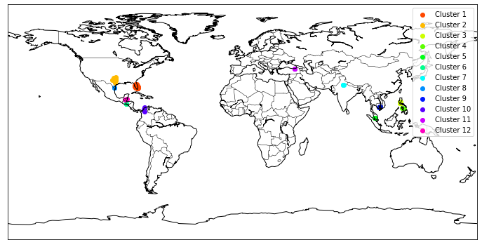
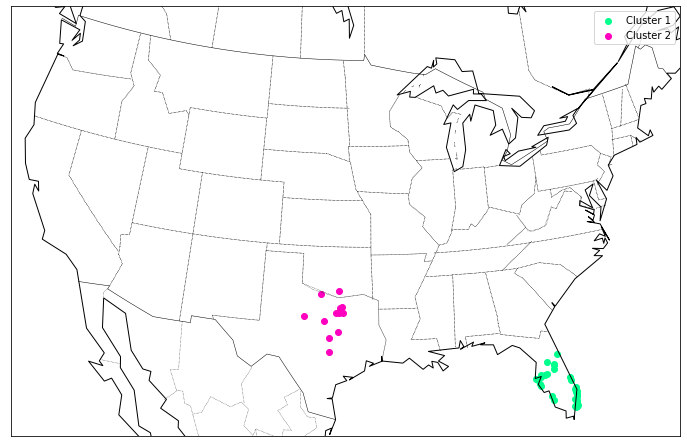

# Project Report: Discovering Disease Outbreaks

## Introduction

This document describes my progress through the [Discovering Disease Outbreaks](https://liveproject.manning.com/module/93_1_1/discovering-disease-outbreaks-from-news-headlines/introduction/about-this-liveproject?) LiveProject from [Manning Publications](https://www.manning.com/). LiveProjects are a new offering from Manning wherein the reader completes a realistic project organized in achievable steps using carefully selected book and video resources. In this LiveProject, the reader (as data scientist) is presented with a dataset of news headlines, from which he must identify one or more disease outbreaks and where these occur geographically. The objective is to inform the World Health Organization (WHO) so they can dispatch resources where they are needed.

The analysis shows that the disease that is most prevalent in the news headlines provided is the Zika virus, and that the outbreak is mostly concentrated around central America, including parts of the southern United States. Other parts of the world affected by the Zika virus include significant portions of South America, portions of South East Asia, and Eastern Australia. Because of the simultaneous occurrence across multiple regions across the globe, the Zika virus outbreak can legitimately be considered a pandemic.

## Methods

The methodology involved to get from news headlines to recommendations for WHO were as follows:

0. We are provided with approximately 650 news headlines captured from various news agencies over a unspecified but small time interval. This allows us to make the assumption that the news headlines reflect the state of world for the time period under consideration.
1. Using the [GeoNamesCache](https://pypi.org/project/geonamescache/), we tag the country and city name references in the headlines. The GeoNamesCache is an database of Country, US States, City names, latitudes and longitudes, along with a Python API that allows access to it. The end product of this tagging step is a dataset of headlines associated with corresponding city and country names. Of 650 headlines, 634 headlines could be fully resolved with both city and country name, 1 in which only the country name could be resolved, and the remaining 15 in which neither country nor city name could be resolved. This step is implemented by the [01-extract-city-country-from-headlines.ipynb](01-extract-city-country-from-headlines.ipynb) notebook.
2. The city and country names were then used to look up the GeoNamesCache database, and the latitude and longitude values corresponding to the city were retrieved. Because not all cities are available within the GeoNamesCache database, or in exactly the same format as mentioned in the news headline, this step was able to match only 600 of the 650 original news headlines. This step is implemented by the [02-find-geolocation-of-headlines.ipynb](02-find-geolocation-of-headlines.ipynb) notebook.
3. The coordinates of the cities found in the headlines were then plotted on a world map using the [Basemap toolkit](https://matplotlib.org/basemap/#). In order to refine our understanding of the city references in the headlines, we clustered these points in 2D space, first using [KMeans](https://scikit-learn.org/stable/modules/generated/sklearn.cluster.KMeans.html), then [DBSCAN](https://scikit-learn.org/stable/modules/generated/sklearn.cluster.DBSCAN.html) with the default Euclidean distance metric, and finally, DBSCAN using a custom distance metric for [Great Circle Distance](https://en.wikipedia.org/wiki/Great-circle_distance), which more accurately reflects physical distance between cities on an almost spherical earth. This step is implemented by the [03-location-based-clustering.ipynb](03-location-based-clustering.ipynb) notebook.
4. The clusters returned are then sorted by size (the number of headlines in the cluster), and within each cluster, the headlines are sorted by geographical proximity to the centroid of the cluster, so headlines for cities located closer to the centroid of the cluster are ranked higher. The top headlines from the top clusters are then manually analyzed to locate patterns that allow us to isolate the disease name being referenced by the news headline. These patterns are then converted into [Regular Expressions](https://en.wikipedia.org/wiki/Regular_expression), which are then run across all the headlines to identify occurrences of disease names. The objective of this exercise is to find disease names that are most prevalent in the news headlines. Based on this exercise, it was discovered that the vast majority of the diseases mentioned in the news headlines are the Zika Virus, with Hepatitis a very distant second. Finally, the original news headlines were filtered to only those that had mentions of the Zika virus, then re-plotted on the map to visually show clusters of outbreaks of the Zika virus. This step is implemented by the [04-discovering-pandemics.ipynb](04-discovering-pandemics.ipynb) notebook.

The last step of analysis was done against the full set of news headlines to find global clusters of the Zika outbreak, as well as a local analysis restricted to the United States. For the global analysis, 200 of the 600 news headlines mentioned the Zika virus, and for the US only analysis, 86 of 200 US specific news headlines mentioned the Zika virus.

## Results

The chart for Zika virus outbreaks over the entire world is shown below. As can be seen, the Zika outbreak is mostly concentrated around central America, including parts of the southern United States. Other parts of the world affected by the Zika virus include significant portions of South America, portions of South East Asia, and Eastern Australia. Because of the simultaneous occurrence across multiple regions across the globe, the Zika virus outbreak can legitimately be considered a pandemic.

The data also shows that the United States is one of the countries that has been most heavily hit by the Zika outbreak. Infections seem to be mostly concentrated in the states of Florida and Texas.

## Discussion

The charts above indicate that the Zika outbreak is mostly concentrated around Central America, with the United States heavily hit. In addition, South East Asia has also been quite heavily hit. This report recommends that the WHO concentrate their containment efforts to these regions.

